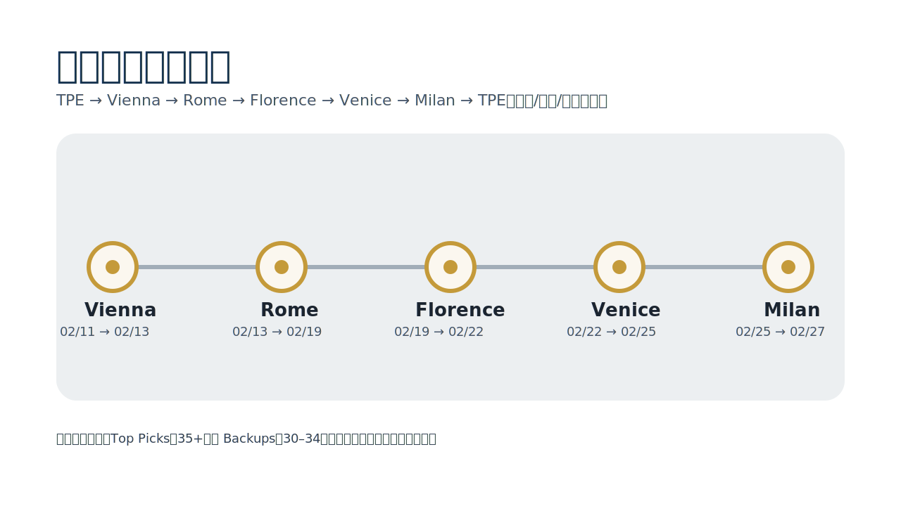
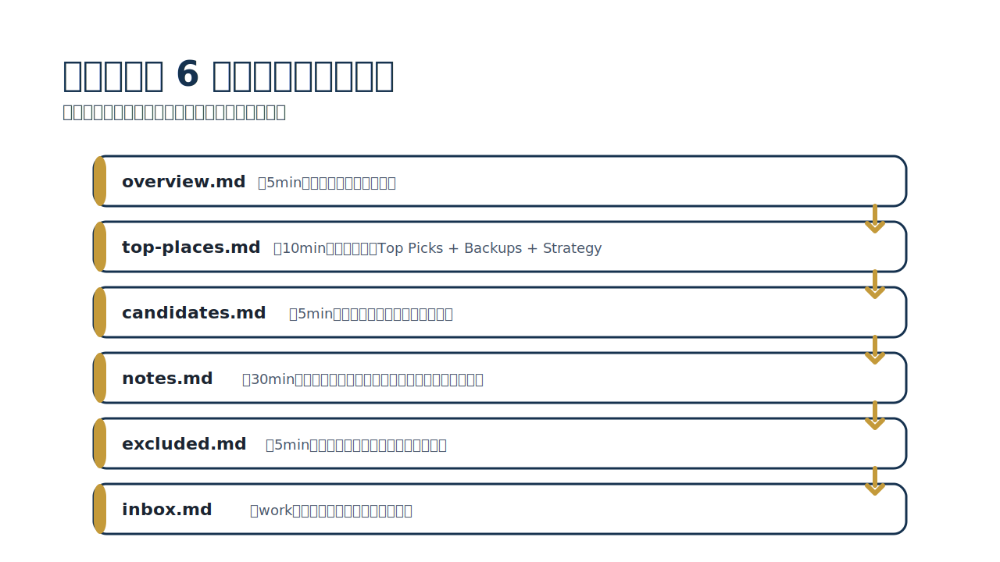
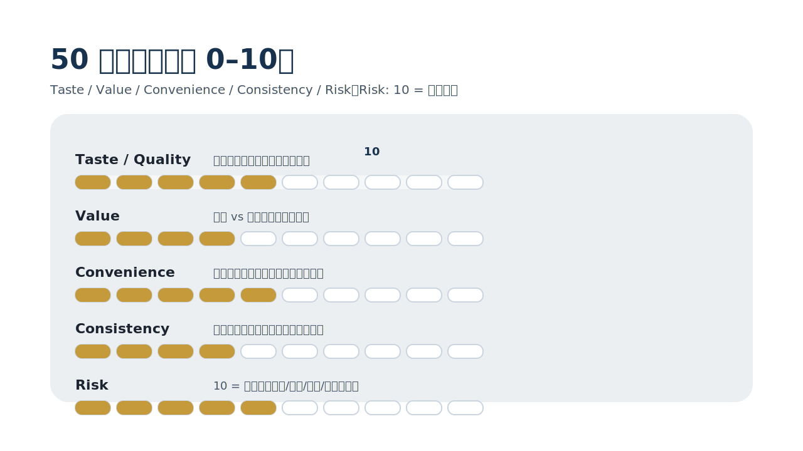
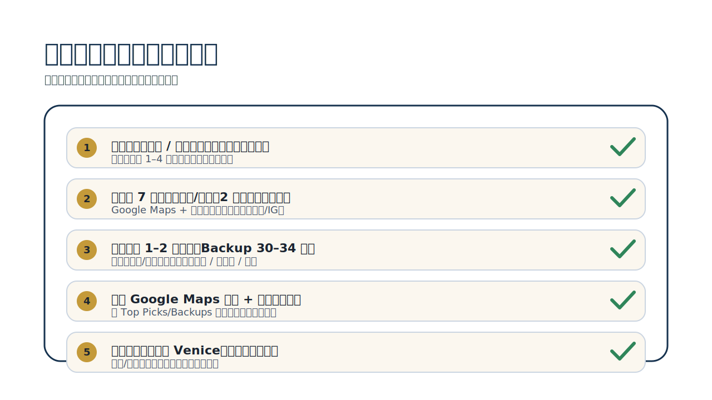

<!-- _class: lead -->

# Vienna → Milan 2026 Gourmet
五城美食研究速覽（證據＋評分＋可追溯）

narumi · 2026-01-14

---

## 今天會看到什麼

- 行程路線（5 城固定）
- Repo 結構（6 檔案，從 `top-places.md` 開始看）
- 50 分評分（Taste / Value / Convenience / Consistency / Risk）
- 五城重點（餐廳 / 咖啡 / 甜點）
- 出發前待辦（訂位 / 確認 / 動線）

---

<!-- _class: lead -->

---

## Repo 怎麼用（每個城市 6 個檔案）

最常用的兩個入口：
- 旅行當天要決策 → `top-places.md`
- 想知道為什麼推薦 → `notes.md`

---

---

---

## 50 分評分（可比較、可追溯）

解讀：
- 40+：非常推薦（Top Pick）
- 35–39：推薦（Top Pick）
- 30–34：可用（Backup）
- <30：考慮排除

---

## 行程一覽（固定，不更動）

| 城市 | 日期 | 住宿 |
|---|---|---|
| Vienna | 2026-02-11 → 2026-02-13 | Hilton Vienna Park |
| Rome | 2026-02-13 → 2026-02-19 | Mercure Roma Piazza Bologna |
| Florence | 2026-02-19 → 2026-02-22 | Hotel Delle Nazioni |
| Venice | 2026-02-22 → 2026-02-25 | Hotel Plaza Venice |
| Milan | 2026-02-25 → 2026-02-27 | Hotel ibis Milano Centro |

偏好與範圍（不變）：
- 不喝酒；不推薦酒吧／酒精導向店

---

## Vienna（維也納）— 經典咖啡館文化＋奧地利料理

- 城市特色：經典咖啡館文化（Kaffeehaus）＋奧地利傳統料理
- 必吃關鍵字：Schnitzel / Tafelspitz / Strudel
- 節奏建議：把「咖啡館」當作每日固定補給點（早餐/下午茶），正餐再挑 1–2 餐重點體驗
- 風險提醒：熱門咖啡館（如 Café Central / Demel）排隊風險高；高端餐廳需提早訂位

---

<!-- _class: cols-2 -->

## Vienna Top Picks（快速介紹）

- [Steirereck](https://www.google.com/maps/search/?api=1&query=Steirereck+im+Stadtpark+Vienna) **41**：米其林三星；預算充足就鎖這家（需提早訂位）
- [Gasthaus Pöschl](https://www.google.com/maps/search/?api=1&query=Gasthaus+Poschl+Vienna) **39**：正統維也納小酒館；經典菜一站式解鎖
- [Plachutta (Wollzeile)](https://www.google.com/maps/search/?api=1&query=Plachutta+Wollzeile+Vienna) **37**：Tafelspitz 指標店；行程很容易塞進去
- [Jonas Reindl](https://www.google.com/maps/search/?api=1&query=Jonas+Reindl+Coffee+Roasters+Vienna) **37**：精品咖啡優先選；適合當轉場外帶
- [Café Landtmann](https://www.google.com/maps/search/?api=1&query=Cafe+Landtmann+Vienna) **36**：老派咖啡館氛圍；甜點＋正餐都能處理

詳情（分數＋證據）：`gourmet/2026-02-11-vienna/top-places.md`

---

## Rome（羅馬）— 羅馬四大麵＋Pizza al Taglio＋Gelato

- 城市特色：節奏快、選擇爆炸多；「排隊/訂位」是體驗品質的分水嶺
- 必吃關鍵字：四大羅馬麵（Carbonara / Cacio e Pepe / Amatriciana / Gricia）、Pizza al taglio、Gelato
- 節奏建議：白天用「外帶＋甜點」快速吃、晚上安排 1 餐好好坐下來的 trattoria
- 風險提醒：熱門店訂位＝成敗關鍵；想吃的先訂，剩下再 walk-in 補位

---

<!-- _class: cols-2 -->

## Rome Top Picks（快速介紹）

- [Antico Forno Roscioli](https://www.google.com/maps/search/?api=1&query=Antico+Forno+Roscioli+Rome) **45**：Pizza al taglio＋麵包店；早上去選擇最多
- [Otaleg](https://www.google.com/maps/search/?api=1&query=Otaleg+Rome) **43**：開心果必點；想吃到頂級 gelato 就跑這家
- [Ditirambo](https://www.google.com/maps/search/?api=1&query=Ditirambo+Rome) **41.5**：季節創意菜；可用 TheFork／OpenTable 提前鎖位
- [Armando al Pantheon](https://www.google.com/maps/search/?api=1&query=Armando+al+Pantheon+Rome) **41**：小店座位少；訂位難但「羅馬經典」完成度高
- [Luciano](https://www.google.com/maps/search/?api=1&query=Luciano+Cucina+Italiana+Rome) **40.5**：carbonara 專攻；想要穩妥「一口到位」適合

詳情（分數＋證據）：`gourmet/2026-02-13-rome/top-places.md`

---

## Florence（佛羅倫斯）— 托斯卡納牛排＋Trattoria＋精品咖啡

- 城市特色：小而密集、步行友善；trattoria 文化濃，排程很好控
- 必吃關鍵字：Bistecca alla Fiorentina、Peposo、Trattoria、Gelato、精品咖啡
- 節奏建議：午餐找「只做中午」的在地店，晚餐再安排一餐重點（牛排或 fine dining）
- 風險提醒：部分小店訂位規則很特別（例如只能特定時間打電話）；營業時段要先確認

---

<!-- _class: cols-2 -->

## Florence Top Picks（快速介紹）

- [Enoteca Pinchiorri](https://www.google.com/maps/search/?api=1&query=Enoteca+Pinchiorri+Florence) **48**：佛羅倫斯 3 星；特殊日子一餐定勝負（需提早訂位）
- [Vini e Vecchi Sapori](https://www.google.com/maps/search/?api=1&query=Osteria+Vini+e+Vecchi+Sapori+Florence) **48**：桌數極少；**19:30 後打電話**才有機會
- [Santa Elisabetta](https://www.google.com/maps/search/?api=1&query=Santa+Elisabetta+Florence) **47**：2 星海鮮向；小而精緻、服務細膩
- [Vivoli](https://www.google.com/maps/search/?api=1&query=Vivoli+Florence) **46**：經典老牌 gelato；尖峰要排，但品質穩
- [Ditta Artigianale](https://www.google.com/maps/search/?api=1&query=Ditta+Artigianale+Florence) **44**：精品咖啡代表；分店多、動線好安排

詳情（分數＋證據）：`gourmet/2026-02-19-florence/top-places.md`

---

## Venice（威尼斯）— Cicchetti 動線＋海鮮＋提拉米蘇

- 城市特色：小店多、座位少；用「cicchetti 小點心」串成一條動線最舒服
- 必吃關鍵字：Cicchetti、海鮮、Tiramisù、糕點
- 節奏建議：白天用甜點/咖啡穿插，晚餐安排 1 餐海鮮或 trattoria；其餘用小點心補足
- 風險提醒：現金需求機率高；San Marco 周邊踩雷機率較高（價格/觀光化）

---

<!-- _class: cols-2 -->

## Venice Top Picks（快速介紹）

- [Fluffy Brunch](https://www.google.com/maps/search/?api=1&query=Fluffy+Brunch+Venice) **44**：舒芙蕾鬆餅早午餐；想吃「非威尼斯傳統」的舒適選項
- [I Tre Mercanti](https://www.google.com/maps/search/?api=1&query=I+Tre+Mercanti+Venice) **44**：提拉米蘇專門；外帶為主、口味多
- [Pasticceria Tonolo](https://www.google.com/maps/search/?api=1&query=Pasticceria+Tonolo+Venice) **44**：在地甜點店；早上去避免售罄
- [Torrefazione Cannaregio](https://www.google.com/maps/search/?api=1&query=Torrefazione+Cannaregio+Venice) **42**：咖啡＋甜點強；運河邊座位加分
- [Suso Gelatoteca](https://www.google.com/maps/search/?api=1&query=Suso+Gelatoteca+Venice) **42**：gelato 高效率；排隊快、口味穩

詳情（分數＋證據）：`gourmet/2026-02-22-venice/top-places.md`

---

## Milan（米蘭）— Risotto/Cotoletta＋糕點

- 城市特色：偏「都會型」用餐：餐廳風格選擇多、甜點咖啡強
- 必吃關鍵字：Risotto alla Milanese、Cotoletta、Panettone/糕點咖啡館
- 節奏建議：停留短（2 天）→ 先把「想吃的類型」定好，再挑店（避免選擇疲勞）
- 風險提醒：熱門餐廳晚餐時間容易滿；高端餐廳務必提早訂位

---

<!-- _class: cols-2 -->

## Milan Top Picks（快速介紹）

- [Enrico Bartolini al Mudec](https://www.google.com/maps/search/?api=1&query=Enrico+Bartolini+al+Mudec+Milan) **42**：米蘭唯一 3 星；預算允許就提早鎖
- [Pavé](https://www.google.com/maps/search/?api=1&query=Pav%C3%A9+Milan) **41**：糕點＋早午餐；肉桂捲／可頌強項（可能排隊）
- [Masuelli San Marco](https://www.google.com/maps/search/?api=1&query=Trattoria+Masuelli+San+Marco+Milan) **38**：經典米蘭菜（cotoletta / risotto）；適合「吃在地」的一餐
- [Marchesi 1824](https://www.google.com/maps/search/?api=1&query=Pasticceria+Marchesi+1824+Milan) **38**：高質感糕點咖啡館；早上去比較舒服
- [Trattoria Milanese](https://www.google.com/maps/search/?api=1&query=Trattoria+Milanese+Milan) **37**：老派經典；晚餐週末務必訂位

詳情（分數＋證據）：`gourmet/2026-02-25-milan/top-places.md`

---

---

<!-- _class: lead -->

# Q&A
