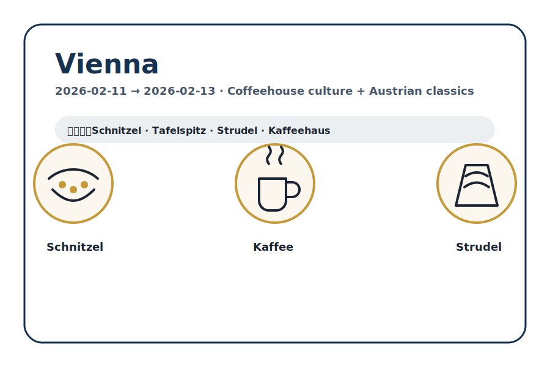
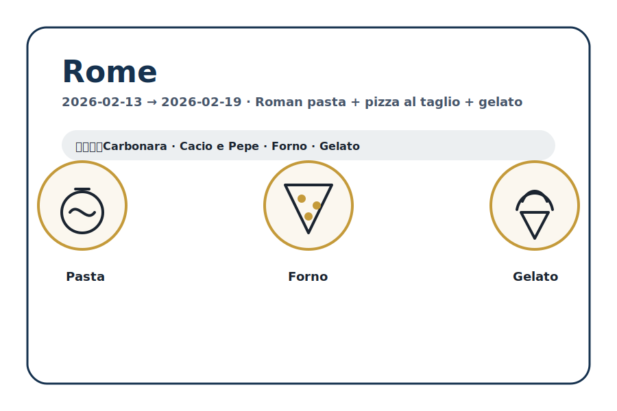
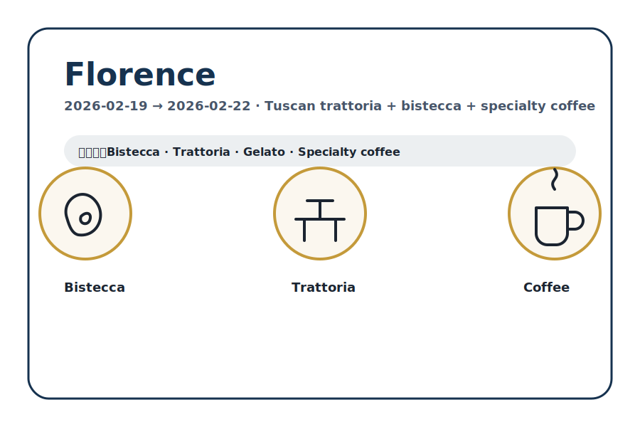
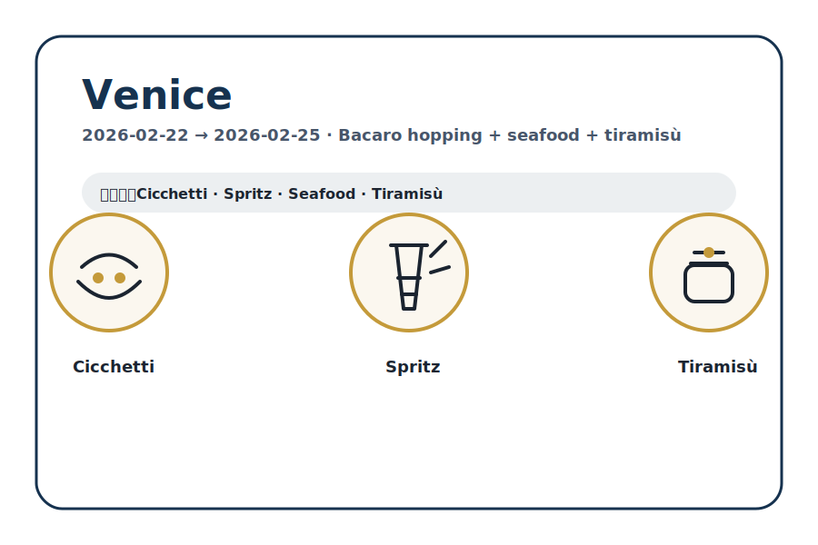
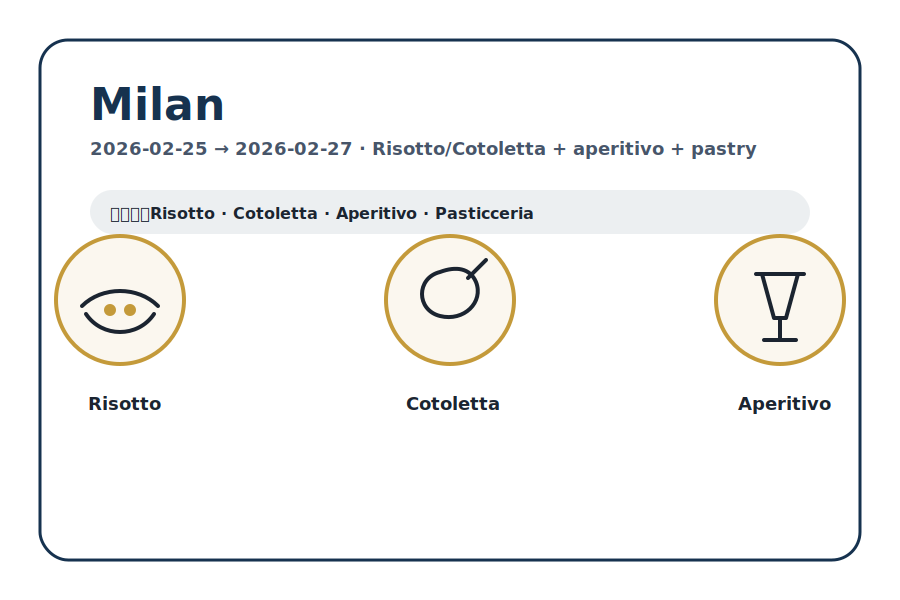

<!-- _class: lead -->

# Vienna → Milan 2026 Gourmet
五城美食研究速覽（證據＋評分＋可追溯）

narumi · 2026-01-14

---

## 今天會看到什麼

1. 行程路線（5 城固定）
2. Repo 結構怎麼看（6 檔案）
3. 50 分評分（Taste/Value/Convenience/Consistency/Risk）
4. 五城重點（餐廳 / 咖啡 / 甜點）
5. 出發前待辦（訂位 / 確認 / 動線）

---

<!-- _class: lead -->

---

## Repo 怎麼用（每個城市 6 個檔案）

最常用的兩個入口：
- 旅行當天要決策 → `top-places.md`
- 想知道為什麼推薦 → `notes.md`

---

---

---

## 50 分評分（可比較、可追溯）

解讀：
- 40+：非常推薦（Top Pick）
- 35–39：推薦（Top Pick）
- 30–34：可用（Backup）
- <30：考慮排除

---

## 行程一覽（固定，不更動）

| 城市 | 日期 | 住宿 |
|---|---|---|
| Vienna | 2026-02-11 → 2026-02-13 | Hilton Vienna Park |
| Rome | 2026-02-13 → 2026-02-19 | Mercure Roma Piazza Bologna |
| Florence | 2026-02-19 → 2026-02-22 | Hotel Delle Nazioni |
| Venice | 2026-02-22 → 2026-02-25 | Hotel Plaza Venice |
| Milan | 2026-02-25 → 2026-02-27 | Hotel ibis Milano Centro |

---

## Vienna（維也納）— 經典咖啡館文化＋奧地利料理

- 吃什麼：Schnitzel / Tafelspitz / Strudel、咖啡館文化
- 精選 Top Picks：Steirereck 41、Pöschl 39、Plachutta 37、Jonas Reindl 37、Landtmann 36
- 提醒：米其林餐廳先訂位；Café Central / Demel 排隊風險
- 入口：`gourmet/2026-02-11-vienna/top-places.md`

---

## Rome（羅馬）— 羅馬四大麵＋Pizza al Taglio＋Gelato

- 吃什麼：Carbonara / Cacio e Pepe、Pizza al Taglio、Gelato
- 精選 Top Picks：Roscioli Forno 45、Otaleg 43、Ditirambo 41.5、Armando 41、Luciano 40.5
- 提醒：熱門店訂位＝成敗關鍵（先鎖定）
- 入口：`gourmet/2026-02-13-rome/top-places.md`

---

## Florence（佛羅倫斯）— 托斯卡納牛排＋Trattoria＋精品咖啡

- 吃什麼：Bistecca / Peposo、Trattoria、Gelato、精品咖啡
- 精選 Top Picks：Enoteca Pinchiorri 48、Vini e Vecchi Sapori 48、Santa Elisabetta 47、Vivoli 46、Ditta Artigianale 44
- 提醒：Vini e Vecchi Sapori 要 **19:30 後**打電話；Sergio Gozzi 只做午餐
- 入口：`gourmet/2026-02-19-florence/top-places.md`

---

## Venice（威尼斯）— Bacaro/Cicchetti 動線＋海鮮＋提拉米蘇

- 吃什麼：Cicchetti + Spritz、海鮮、Tiramisù、糕點
- 精選 Top Picks：Fluffy Brunch 44、I Tre Mercanti 44、Tonolo 44、Torrefazione Cannaregio 42、Suso 42
- 提醒：現金需求機率高；小店座位少（排/訂位）；San Marco 周邊風險較高
- 入口：`gourmet/2026-02-22-venice/top-places.md`

---

## Milan（米蘭）— Risotto/Cotoletta＋Aperitivo＋糕點

- 吃什麼：Risotto / Cotoletta、Aperitivo、糕點
- 精選 Top Picks：Bartolini al Mudec 42、Pavé 41、Masuelli 38、Marchesi 38、Bar Basso 36
- 提醒：停留 2 天 → 先鎖定 4–5 餐；三星務必提前訂位
- 入口：`gourmet/2026-02-25-milan/top-places.md`

---

---

<!-- _class: lead -->

# Q&A

需要我把這份 deck 拆成「每城 2 張（Top Picks / Backups）」版本嗎？
